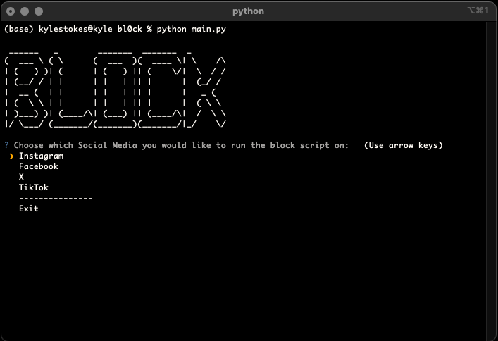

# bl0ck
[](https://github.com/kylest0kes/bl0ck.git)

** NOTE ** This is for demo POC purposes only. ** NOTE **

Ever wanted to block a huge list of people from social media with one action???? I have. And if you have as well, lemme introduce bl0ck. With bl0ck, there are 4 different scripts that will be available that will be able to make it fast and easy to block a vast list of people on Instagram, TikTok, X (I caved), and Facebook. 

** Hypothetical ** Mission Statement: (C)ould (E)xclusively (L)ookup (E)very (B)it (R)elated (I)n (T)hat (I) (E)ven (S)ee and (C)an (O)ften (M)ake (P)eople (A)ctually (N)eed (I)t (E)xtra (S)erious. Block them all :)

## How Does It Work?


1. Clone or Download the Repo to a directory of your choosing
    ```sh
    git clone https://github.com/kylest0kes/bl0ck.git
    ```

2. Edit the various 'block_list' files for the desired Social Media to include all the accounts you wish to block (be sure to follow the proper pattern with URLs)
    ```python
    to_be_blocked = [
        {
            'name': 'Person 1',
            'url': 'https://www.instagram.com/person1username/'
        },
        {
            'name': 'Person 2',
            'url': 'https://www.instagram.com/person2username/'
        }
    ]
    ```

3. Open a terminal window and 'cd' into the directory
    ```sh
    cd /path/to/cloned/repo
    ```

4. Install all the required packes from the 'requirements.txt' file
    ```sh
    pip install -r requirements.txt
    ```

5. From the root of the Repo, run the 'main.py' file
    ```sh
    python main.py
    ```

5. Select 1 of the 4 Social Media sites from a list (you can also exit)

6. Enter your username/email and password when it prompts you to
    - Note: If you are running the TikTok script, be ready to complete the Captcha that comes up after logging in.

7. Sit back and watch as your account is purged!

    

## Requirements
* pip
* selenium
* python

## License
Copyright 2024 Kyle Stokes (kylestokes1551@gmail.com)

Licensed under the Apache License, Version 2.0 (the "License"); you may not use this file except in compliance with the License. You may obtain a copy of the License at:

    http://www.apache.org/licenses/LICENSE-2.0

Unless required by applicable law or agreed to in writing, software distributed under the License is distributed on an "AS IS" BASIS, WITHOUT WARRANTIES OR CONDITIONS OF ANY KIND, either express or implied. See the License for the specific language governing permissions and
limitations under the License.


## Disclaimers
Again, this is "for demo proof of concept purposes only" and totallyyy is not intended to be used to block a large list of terrible people on these different websites.

Also, while the application does ask for a username/email and pasword for the various sites, I do not have, and will never implement, any type of code to store your username/email and passwords anywhere.